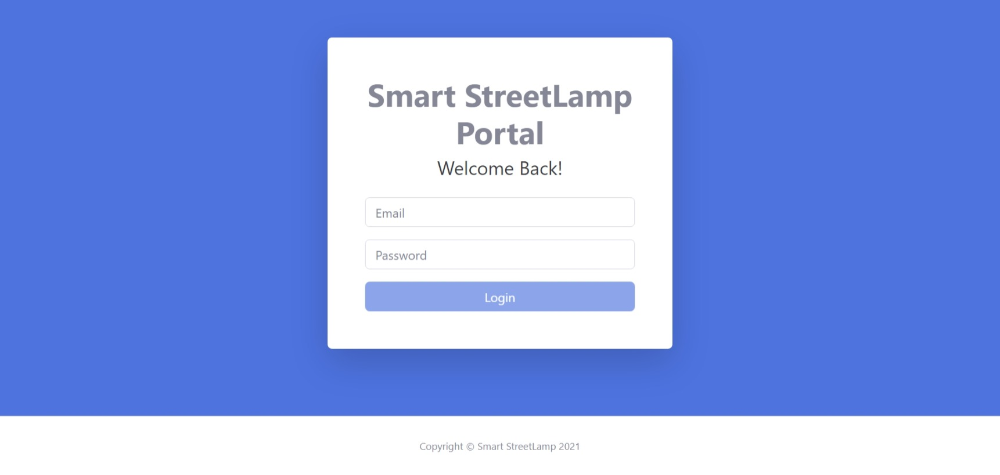
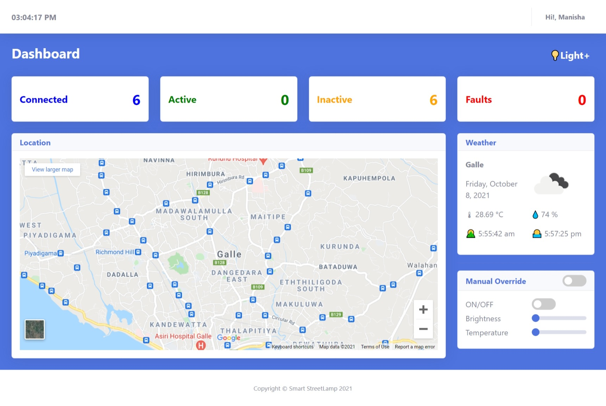
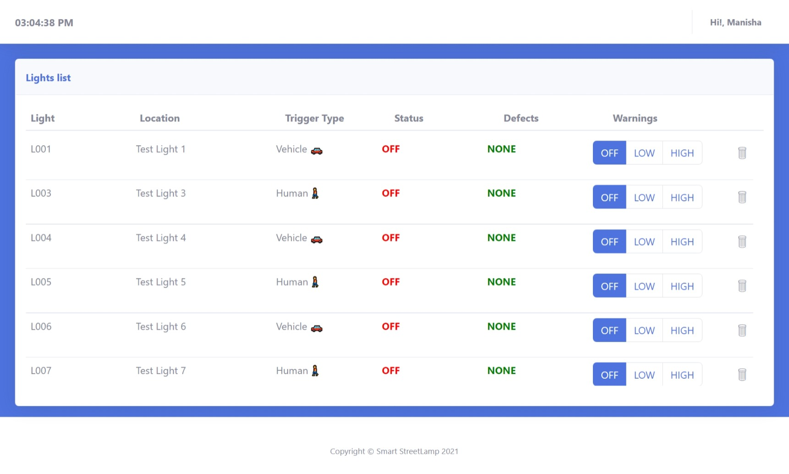
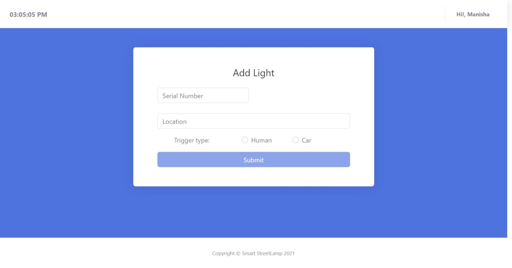
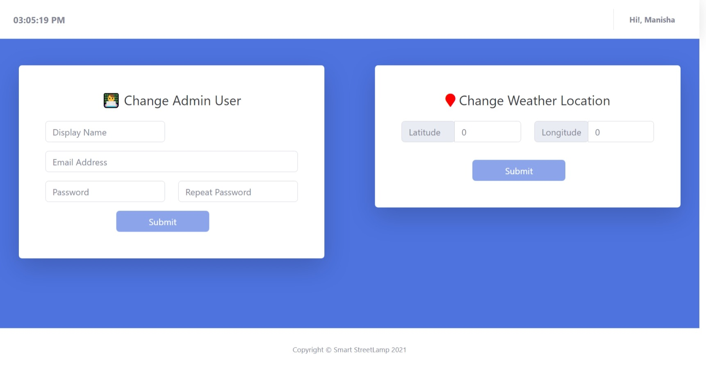

# Multifunctional Smart IoT Streetlamp System - Frontend

This repository contain the code for dashboard of the Multifunctional Smart IoT Streetlamp System. It is developed using React Js and Firebase has been used as a backend as a service (BaaS). 

Following services of Google Firebase has been used for this project.

- Realtime Database
- Hosting
- Authentication

## Current Status of the Project

Project is completed upto 95%. Only some bug fixes left.







## How to Contribute

You are always welcome to contribute to this project.

## How to run

### Prerequisites:
- Node Js

### This is a React Js project.

1. Clone this project to your local machine.
2. Navigate to root directory of this project.
3. To run the project, execute the command ```npm start```
4. To build the project, execute the command ```npm run build```